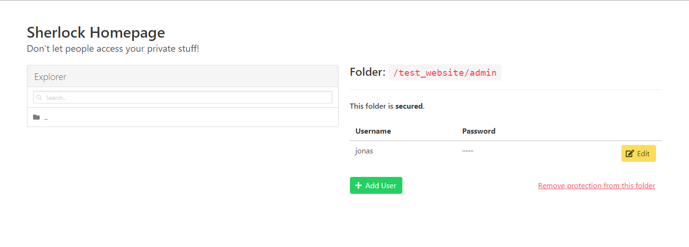
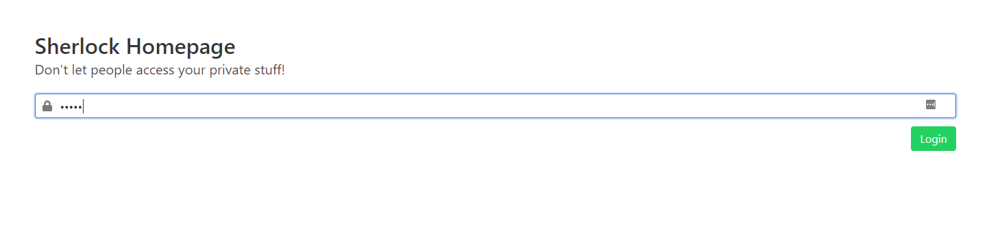

# Sherlock Homepage

## About

I made Sherlock Homepage for my personal needs. I needed a little .htpasswd-Manager and also I thought it would be a fun project to do.  
Therefore, the code is pretty ugly and everything is in one single file.  
Although, the fact that everything happens in one file, makes Sherlock Homepage even more useful for my needs!

## How to install

To install Sherlock Homepage, just put the `SherlockHomepage.php` file in the root folder of your webserver.  
Then proceed with setting the password.

## How to set the Sherlock Homepage password

To set the password, go to `yourwebsite.com/SherlockHomepage.php?setPassword=1` and enter the preferred password there.  
The password is stored in the file itself. (It basically edits itself and replaces the old password).  
The default password is "admin"!

## How to use

To access Sherlock Homepage, just go to `yourwebsite.com/SherlockHomepage.php` and enter your password.  
Now you should be redirected to the dashboard.  
Here you have a file explorer on the left, to select the folder, and some other stuff on the right, where you can manage the current folder's password-protection.  
It should be relatively self explaining.

## Screenshots

